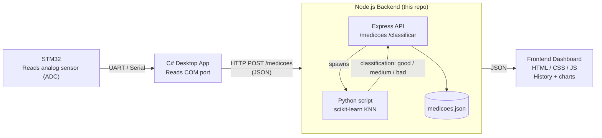

# STM32 Classifier Server

A small pipeline that reads analog sensor data from an STM32 microcontroller, forwards it to a Node.js backend, classifies each measurement with a Python/scikit-learn KNN model, and displays the results in a web dashboard.

This repository contains the **backend** (Node.js + Python classifier) and the **frontend** (static dashboard). The STM32 firmware and the C# serial-port bridge are external components that talk to this backend over HTTP — see the architecture diagram below.

## Architecture



**Flow summary:**
1. The **STM32** samples a sensor through its ADC.
2. A **C# desktop application** reads the value from the serial (COM) port and sends it as JSON to the backend.
3. The **Node.js backend** receives the JSON, calls the **Python script** to classify the sample (good/medium/bad) using a KNN model, and stores the result.
4. The **frontend** fetches the stored, classified measurements and renders the history table and dashboard.

## Languages & Technologies

| Layer | Technology |
|---|---|
| Backend server | Node.js, Express |
| Classification | Python 3, scikit-learn (KNN) |
| Frontend | HTML, CSS, vanilla JavaScript |
| Data storage | JSON file (`data/medicoes.json`) |
| Sensor firmware (external) | C (STM32 ADC firmware) |
| Serial bridge (external) | C# (reads COM port, sends HTTP requests) |

## Project Structure

```
medicoes-backend/
├── server.js               # Express server: /medicoes and /classificar routes, also serves the frontend
├── package.json
├── data/
│   └── medicoes.json        # stored, classified measurements
├── python/
│   ├── classify.py          # trains a KNN classifier and predicts a sample
│   ├── dataset.csv          # 30-sample training dataset
│   └── requirements.txt
└── public/
    ├── index.html            # measurement form + dashboard
    ├── styles.css
    └── app.js
```

## Prerequisites

- [Node.js](https://nodejs.org/) 18+ and npm
- [Python](https://www.python.org/) 3.9+ and pip

## Installation

1. Install the Node.js dependencies:
   ```bash
   npm install
   ```

2. Create a Python virtual environment and install the classifier's dependencies:
   ```bash
   python3 -m venv .venv
   source .venv/bin/activate      # on Windows: .venv\Scripts\activate
   pip install -r python/requirements.txt
   ```
   This installs the only required package: `scikit-learn` (pulls in `numpy`/`scipy` automatically).

## Running the server

Point the backend at the virtual environment's Python interpreter and start it:

```bash
PYTHON_BIN=./.venv/bin/python node server.js
```

On Windows (cmd):
```cmd
set PYTHON_BIN=.venv\Scripts\python.exe && node server.js
```

By default the server listens on port `3000` (override with the `PORT` environment variable). Open [http://localhost:3000](http://localhost:3000) in a browser to use the dashboard.

If `PYTHON_BIN` is not set, the server falls back to the `python3` command on your `PATH`.

## API Endpoints

| Method | Route | Description |
|---|---|---|
| `GET` | `/medicoes` | List all stored, classified measurements |
| `POST` | `/medicoes` | Classify and store a new measurement — body: `{ "sample": [n1, ..., nN] }` |
| `POST` | `/classificar` | Classify a sample without storing it — body: `{ "sample": [n1, ..., nN] }` |
| `GET` | `/config` | Get how many numeric values (`valueCount`) a sample must contain |
| `PUT` | `/config` | Update `valueCount` — body: `{ "valueCount": N }` |

`valueCount` defaults to `3` and is stored in `data/config.json`. It must match the number of feature columns in `python/dataset.csv`, or classification will fail. The web app's **Settings** page updates it for you.

Example:
```bash
curl -X POST http://localhost:3000/medicoes \
  -H "Content-Type: application/json" \
  -d '{"sample":[8.7,9.1,8.9]}'
```

See the in-app **How to Send Data** page (or `public/index.html`) for a detailed walkthrough — including a humidity-sensor example — of how a sample should be shaped for the model to classify it correctly.

## Classifier notes

`python/classify.py` trains a `KNeighborsClassifier` (k=5) on `python/dataset.csv` (30 samples, 3 features each) every time it runs, then predicts the label — `good`, `medium`, or `bad` — for the given sample. Replace `dataset.csv` with real sensor data (same header/label format, and the same number of feature columns as `valueCount`) to match your actual measurements.
